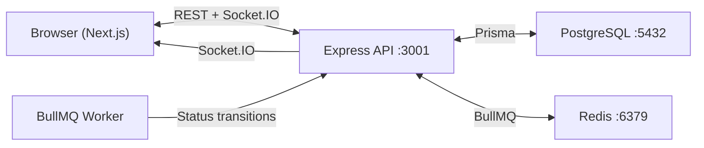

# 🔧 Instant Mechanic

A production-grade SaaS dashboard for managing roadside/vehicle mechanic services in real time. Built as a TypeScript monorepo with an Express API backend and a Next.js frontend.

## Tech Stack

| Layer | Technology |
|---|---|
| **Frontend** | Next.js 14 (App Router), TypeScript, Tailwind CSS, shadcn/ui, Recharts, TanStack Query |
| **Backend** | Express.js, TypeScript, Prisma ORM, Zod validation, Swagger/OpenAPI |
| **Real-time** | Socket.IO (WebSocket + polling fallback) |
| **Background Jobs** | BullMQ (Redis-backed queue) |
| **Database** | PostgreSQL 16 |
| **Cache/Queue** | Redis 7 |
| **Infra** | Docker Compose, GitHub Actions CI |
| **Monorepo** | pnpm workspaces + Turborepo |

## Architecture



## Local Setup

### Prerequisites

- Node.js 20+
- pnpm 9+
- Docker & Docker Compose (for Postgres + Redis)

### Quick Start

```bash
# 1. Clone and install
git clone <repo-url>
cd instant-mechanic
pnpm install

# 2. Start Postgres + Redis
docker-compose up -d postgres redis

# 3. Set up environment
cp .env.example apps/api/.env

# 4. Run database migrations + seed
pnpm db:migrate
pnpm db:seed

# 5. Start development servers
pnpm dev
```

The API will be at `http://localhost:3001` and the frontend at `http://localhost:3000`.

## API Endpoints

| Method | Endpoint | Description |
|---|---|---|
| `GET` | `/api/dashboard` | Dashboard aggregate statistics |
| `GET` | `/api/bookings` | List bookings (paginated, filterable, sortable) |
| `GET` | `/api/bookings/:id` | Get booking by ID |
| `PATCH` | `/api/bookings/:id/status` | Update booking status |
| `GET` | `/api/mechanics` | List mechanics |
| `GET` | `/api/mechanics/:id` | Get mechanic by ID |
| `GET` | `/api/customers` | List customers (paginated) |
| `GET` | `/api/health` | Health check |
| `GET` | `/api/docs` | Swagger interactive API docs |

## Environment Variables

| Variable | Default | Description |
|---|---|---|
| `DATABASE_URL` | — | PostgreSQL connection string |
| `REDIS_URL` | `redis://localhost:6379` | Redis connection string |
| `PORT` | `3001` | API server port |
| `CORS_ORIGIN` | `http://localhost:3000` | Allowed CORS origin |
| `NEXT_PUBLIC_API_URL` | `http://localhost:3001` | API URL for the frontend |

## Project Structure

```
├── apps/
│   ├── api/                    # Express API backend
│   │   ├── prisma/             # Schema + seed
│   │   └── src/
│   │       ├── controllers/    # Request handlers
│   │       ├── services/       # Business logic
│   │       ├── routes/         # Express routers + OpenAPI annotations
│   │       ├── schemas/        # Zod validation schemas
│   │       ├── middleware/     # Error handling, validation, rate limiting
│   │       ├── sockets/        # Socket.IO setup
│   │       ├── jobs/           # BullMQ workers
│   │       ├── lib/            # Prisma, Redis, Swagger singletons
│   │       └── types/          # Shared TypeScript types
│   └── web/                    # Next.js frontend
├── docker-compose.yml
├── turbo.json
└── package.json
```

## License

MIT
